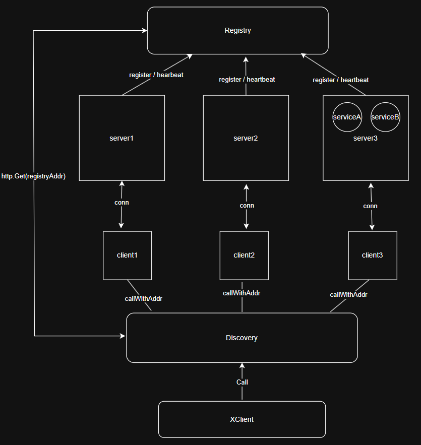

1. 用 map 存一个编码解码方式到codec构造函数的映射。
   根据从 option 头中 json 解码出来的字段判断具体的解码方式是怎么样的，然后再调用构造函数基于 conn 来拿到一个可以向 socket 中写入和读出的 codec 实现类的实例

2. client 端首先 Dial() 建立连接，然后起一个 Client 实例，实例开启一个 receive 协程；一个 Server 实例每接收到一个 Client 实例的连接，就开启一个协程处理这个 Client 的请求
   为了可以接收响应，client 需要把其进程接收响应的内存地址作为参数提供给框架的 client

3. 并发安全：每个客户端和服务端都分别只有一个读缓存和写缓存，在写入写缓存时都需要加锁；在从读缓存中读取的时候，都采用串行读的操作（server 会为每个读成功开一个协程继续处理读到的请求）

4. 多个协程分别使用同一个客户端并发发送请求，如何保证客户端在接收到批量响应后能够将每个协程的请求与其期望的响应匹配起来

5. 编写了 ServiceImpl 结构体之后，绑定的远程调用方法如何与 sever 端解码的客户端请求方法对应起来

   一个 Server 实例通过一个 sync.map 来记录所有创建的服务；一个 service 实例通过一个 map 来记录所有绑定的方法

6. handleRequest 方法中，通过 Atomic 来实现内存可见性，在协程外部修改闭包变量，保证修改结果在协程内可见

7. 类似于 gRPC 的思路，gRPC 使用 HTTP/2 作为传输层，但在连接建立后，通信是基于流的、双向的，而不受限于传统 HTTP 请求-响应模式。

8. 支持负载均衡：每个注册过的 server addr 有一个固定的 Client 负责通信，使用 map 记录映射信息；使用 XClient 实例负责统一调用 Call (rpc请求)，懒加载地创建 Client 实例，并放到 map 中。使用 Client 和 server addr 的好处在于可以复用同一个连接 (net.Conn)

9. 心跳机制：服务端启动 server 的同时通过协程定期向注册中心进程发送心跳，服务端通过 ServeHTTP 方法，在每个 HTTP 请求到来时，都会调用一次全员健康检查以及心跳更新

10. 考虑到网络 I/O 成本，在发现中心本地维护一个 servers 的缓存，通过 超时时间 + 懒加载 的方式从注册中心获取最新服务列表

go run registry_app/registry_app.go

go run server_app/server_app.go
