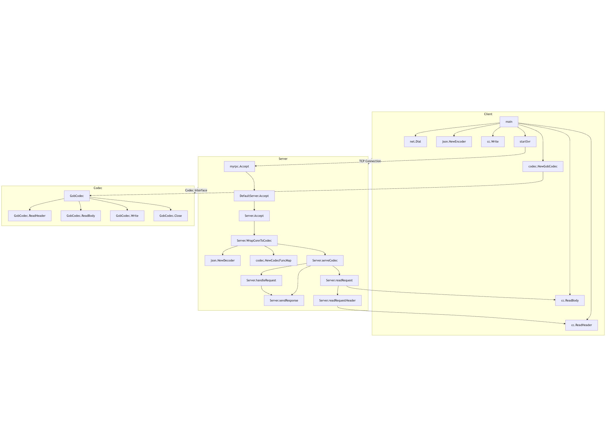

1:

1.
用 map 存一个编码解码方式到codec构造函数的映射。
根据从 option 头中 json 解码出来的字段判断具体的解码方式是怎么样的，然后再调用构造函数基于 conn 来拿到一个可以向 socket 中写入和读出的 codec 实现类的实例。

2.
核心问题：多个协程分别使用同一个客户端并发发送请求，如何保证客户端在接收到批量响应后能够将每个协程的请求与其期望的响应匹配起来